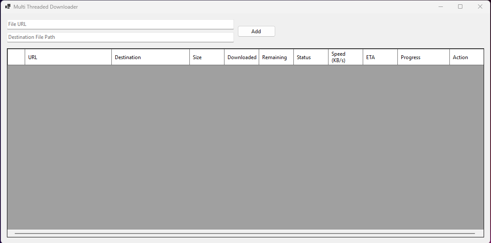

# FileDownloadApp

A multi-threaded file downloader for Windows, built with .NET 8 and Windows Forms.



## Features

- Download multiple files concurrently (up to 3 at a time by default)
- Pause and resume downloads
- Shows progress, speed, ETA, and file sizes
- Resumes downloads automatically if network connection is restored
- User-friendly interface with progress bars

## Getting Started

### Prerequisites

- [.NET 8 SDK](https://dotnet.microsoft.com/download)
- Windows OS

### Building and Running

1. Clone the repository:
    ```sh
    git clone https://github.com/ozanguneyli/FileDownloadApp.git
    cd FileDownloadApp/FileDownloadApp
    ```

2. Build and run the project:
    ```sh
    dotnet run --project FileDownloadApp.csproj
    ```

Or open the solution in Visual Studio or VS Code and press **F5** to run.

## Usage

1. Enter the file URL and the destination path.
2. Click **Add** to queue the download.
3. Use the **Pause** and **Resume** buttons to control downloads.
4. Monitor progress, speed, and ETA in the table.

## Project Structure

- `Form1.cs` - Main form logic
- `DownloadService.cs` - Download management and concurrency
- `DownloadItem.cs` - Download item model
- `DataGridViewProgressBarCell.cs` - Custom progress bar cell for the UI

## License

MIT License. See [LICENSE](LICENSE) for details.